# Liebes Tagebuch ...

Ziel von "Liebes Tagebuch..." war es ein möglichst flexibles Tagebuch an
zu bieten. Also keines nur für Reisen, nur für Musik oder nur für
klassischen Text. Daher muss "Liebes Tagebuch..." vielfältige Funktionen
bieten.

In die App kann man sich per Fingerabdruck einloggen oder auch klassisch
mit einem Passwort.

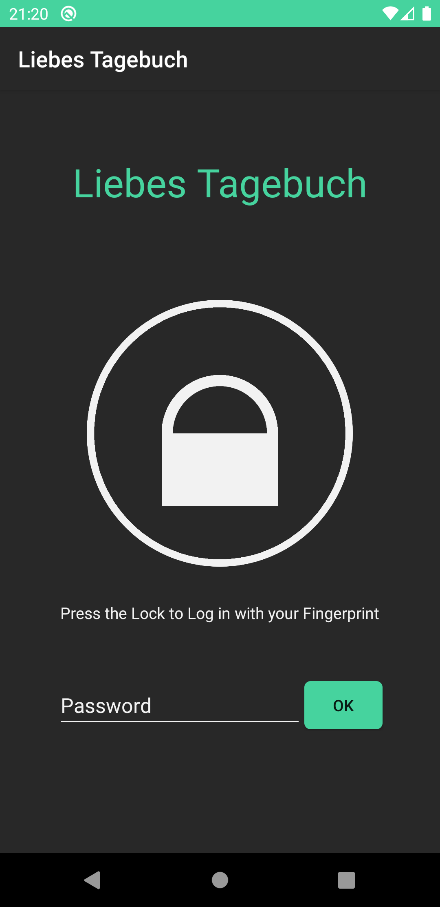

In der darauffolgenden Grid-Ansicht hat man für jeden Tag seit der
Installation (beziehungsweise dem ersten Start) einen Eintrag, somit entsteht kein großes Chaos durch zu
viele unbekannte Dateien, jeder Eintrag zeigt, wenn vorhanden, die in
ihm gewählte Emotion an, somit kann man seine Emotionen tracken.

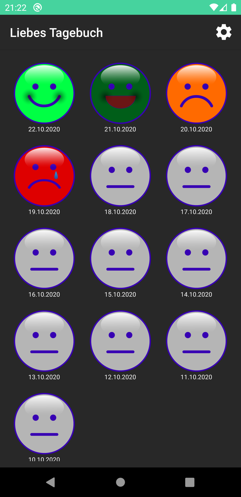

Von der GridActivity kann man zu den Einstellungen gelangen, wo man eine
tägliche Notification aktivieren (falls man sein gesamtes Leben
aufzeichnen möchte), die Verschlüsselung an- und ausschalten oder sein
Passwort ändern kann.

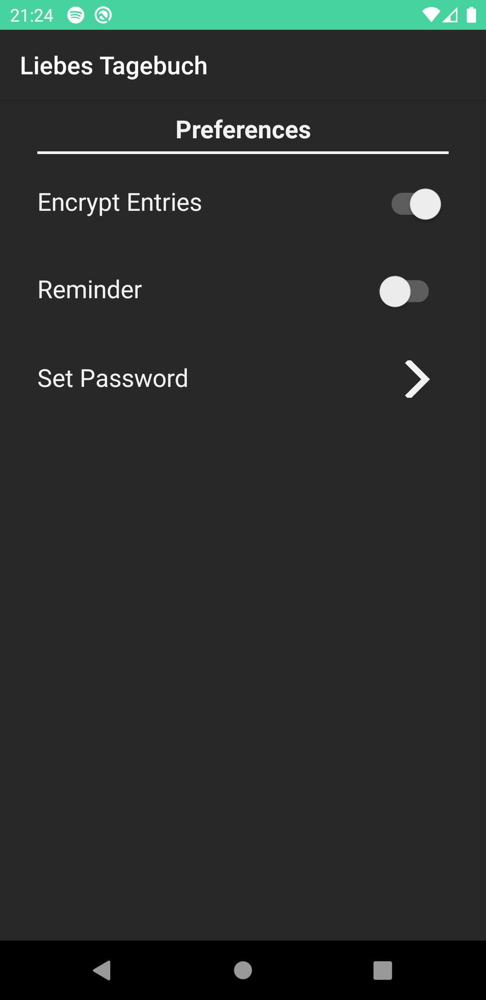

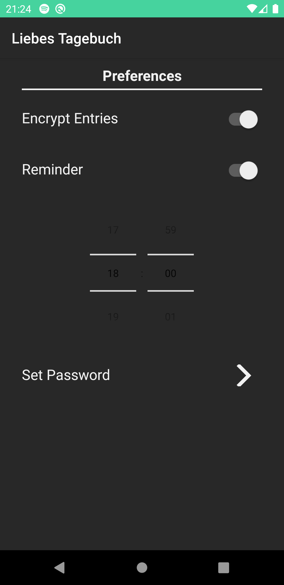

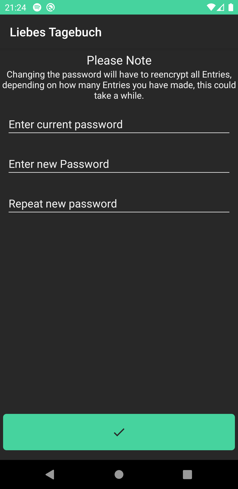

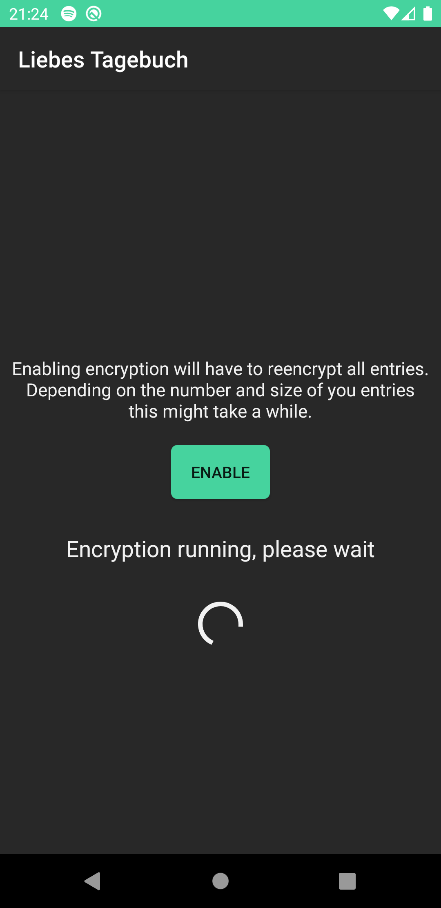

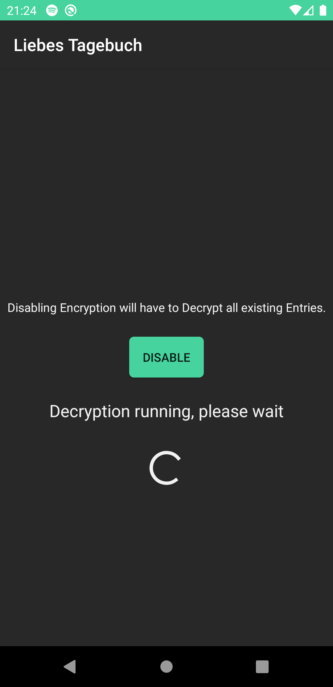

"Liebes Tabebuch..." verschlüsselt alle Einträge (wenn
gewünscht) nach 256-Bit-AES-Standard und legt die Passwörter in einem
geschützten Bereich des Betriebssystems ab.

Klickt man im Grid auf einen Eintrag gelangt man in die Detailansicht,
hier kann man die gewählte Emotion ändern, neue Boxen hin zu fügen oder
vorhandene Boxen löschen oder bearbeiten. Von jeder Box kann man (fast)
beliebig viele hin zu fügen, so dass man zum Beispiel an einem Tag auch
mehrere Orte aufzeichnen kann. Das Box-Prinzip ist auch erweiterbar, so
dass mit vergleichsweise geringem Aufwand auch neue Boxen für andere
Zwecke hinzugefügt werden könnten.

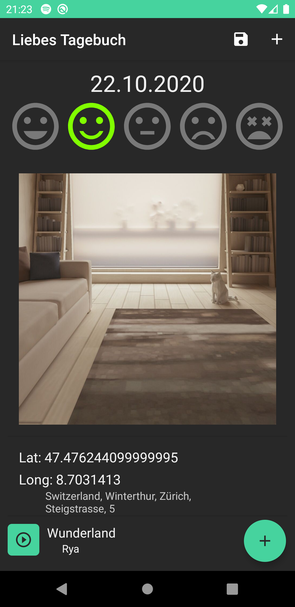

Es gibt viele verschiedene Typen von Boxen für unterschiedliche Zwecke.
Text- und Headerboxen sind simple TextViews, wobei zweitere der
Strukturierung dienen.

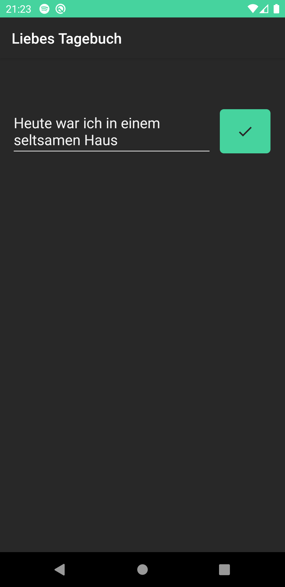

PictureBoxen enthalten Bilder, die man mit der Kamera aufnehmen oder aus
der Galerie wählen kann.

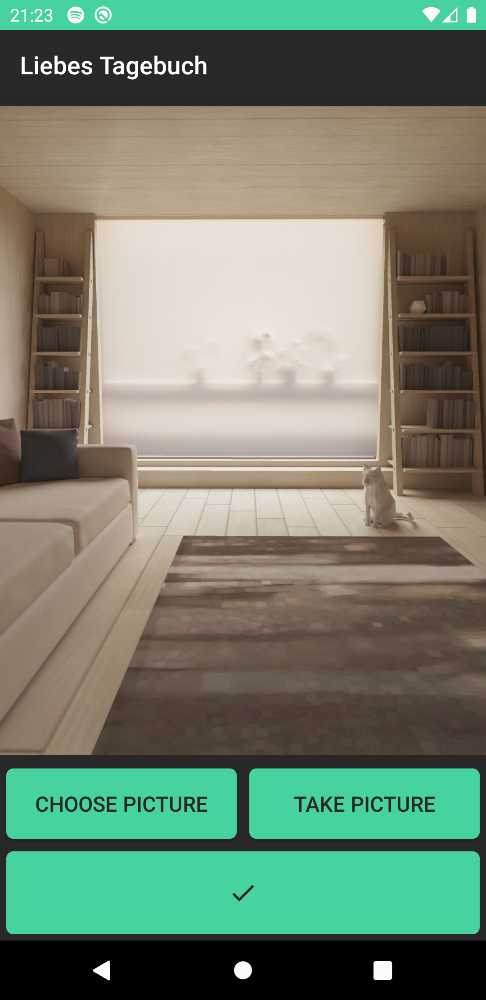

SpotifyBoxen erlauben es (wenn man ein Spotify-Konto hat) Songs zu
suchen oder per Link hinzu zu fügen, Informationen über diese ab zu
rufen und die Songs in der Spotify-App ab zu spielen.

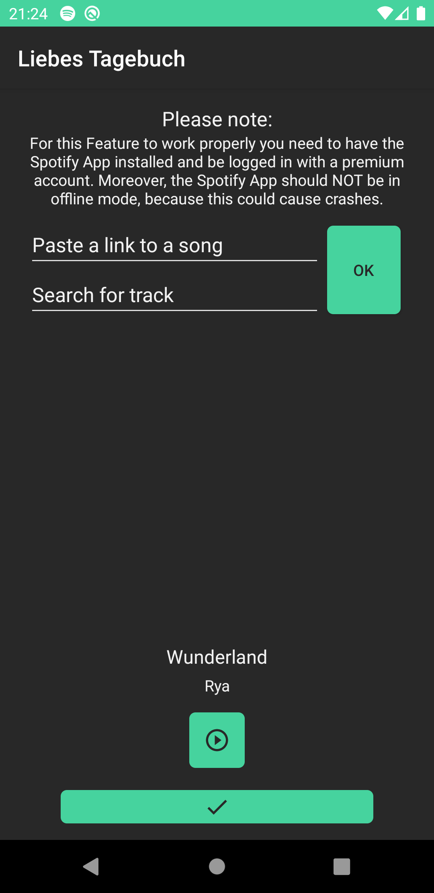

MapBoxen erlauben es einen Standort oder eine Sehenswürdigkeit dem
Tagebucheintrag hinzu zu fügen und auf einer Karte anzeigen zu lassen.

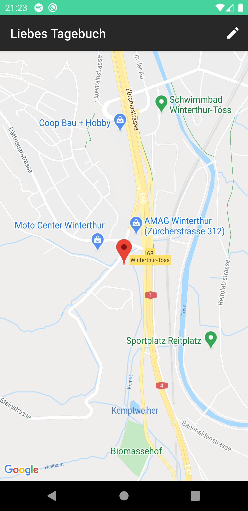

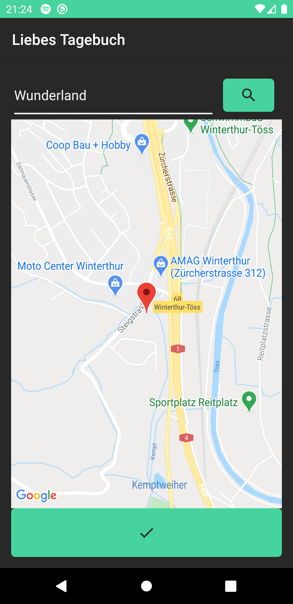

Video: https://1drv.ms/v/s!AmZwwR3ZzIbIqDJsrULWR3I0NU1q?e=QKDmiu

## Hinweis

Da wir uns nach der Klausur unsicher waren, ob noch eine Information zu
den Respotories kommt, haben wir uns selbst informiert und ein eigenes
Repository eingerichtet und dort angefangen zu programmieren. Aus
Gründen der Kontinuität sind wir auch später nicht zu dem offiziellen
UniRegensburg-Repository gewechselt. Während der master-branch beider
Repositories übereinstimmen, ist es wahrscheinlich am besten unser
anderes Repository zu betrachten, um unseren Workflow nach zu voll
ziehen.

Dieses finden Sie unter: https://github.com/ragor114/LiebesTagebuch

## Team

#### Jannik Wiese

Jannik Wiese, E-Mail: Jannik.Wiese@stud.uni-regensburg.de, Github: Ragor114 (https://github.com/ragor114).

Entwicklung von:

Verschlüsselung und Umwandlung von Boxen in Strings mit
StringTransformerHelper.

Speichern und Abrufen von Passwörtern mit SecurePasswordSaver.

GridAdapter für GridActivity.

DetailActivity inklusive Adapter, Kommunikation mit anderen Activities,
Speichern in Datenbank und Funktionalität wie hinzufügen und löschen von
Boxen.

Alle Boxen inklusive getView()-Methoden und EditActivities (außer Bilder
aufnehmen oder wählen für PictureBox).

Anbindung der Spotify- und SpotifyWebAPI

GoogleMaps-Anbindung.

Reaktion auf Einstellungen wie z.B. neuverschlüsseln beim Ändern des
Passworts.

Außerdem: Allgemeine Projektplanung, Github-Verwaltung.

#### Moritz Schnell

Moritz Schnell, E-Mail: Moritz.Schnell@stud.uni-regensburg.de, Github: BrokeMo (https://github.com/BrokeMo).

GridActivity außer GridAdapter.

LoginActivity inklusive Login per Fingerabdruck.

Regelmäßige Notification entsprechend der Einstellung mit Hilfe von
Alerts.

Verbesserung der Datenbank (Austausch AsyncTasks -> Runnables).

Außerdem: Appicon-Design.

#### Jonas Distler

Jonas Distler, E-Mail: Jonas.Distler@stud.uni-regensburg.de, Github: jnsds (https://github.com/jnsds).

Datenbank inklusive Helper und Dao für alle Abfragen (mit AsyncTask,
durch Moritz Schnell verbessert).

Settings (Activity und speichern in Shared Preferences).

Allgemeine Designverbesserungen.

Außerdem: Designkonzept und -entwicklung.

## Guidelines zur Nutzung dieses Repositorys

### Allgemeine Hinweise und Vorgaben

* Das Repository besteht im initialen Stand aus einem einzelnen Master-Branch. Versuchen Sie bei der Arbeit am Projekt darauf zu achten, dass sich in diesem Branch stets die aktuell lauffähige und fehlerfreie Version Ihrer Anwendung befindet. Nutzten Sie für die eigentliche Entwicklung ggf. weitere Branches.
* Gehen Sie sorgfältig bei der Erstellung von Issues und *Commit Messages* vor: Die Qualität dieser Artefakte fließt nicht in die Bewertung ein, trotzdem sollten Sie versuchen, Ihr Vorgehen anhand nachvollziehbarer Versionseinträge und klarere Aufgabenbeschreibung gut zu dokumentieren.
* Halten Sie diese Readme-Datei(en) stets aktuell.
* Spätestens zur Projektabgabe legen Sie eine Release-Version des finalen Stands Ihrer Anwendung an und hängen an diese eine installierbare (Debug-) APK-Datei an.
